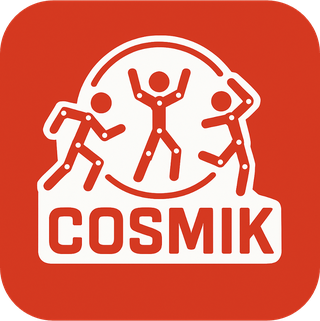
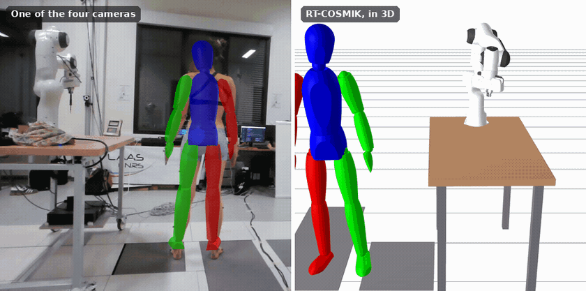
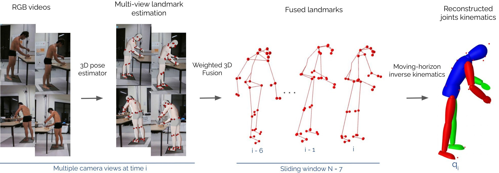
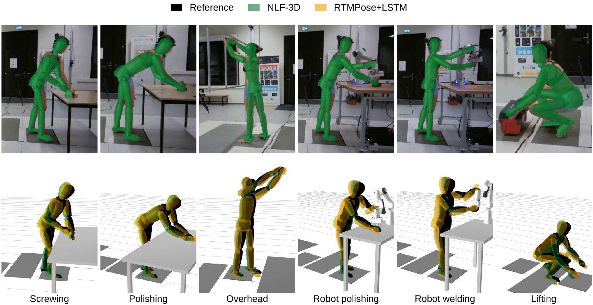

<p align="center">
  
</p>

<h1 align="center">RT-COSMIK</h1>

<p align="center">
  <b>Real-time, markerless, whole-body biomechanics from ordinary cameras.</b><br>
  Joint angles of an anatomical human model, from one to four webcams, at 40&nbsp;Hz.
</p>

<p align="center">
  <a href="LICENSE"></a>
  
  
  
  <a href="https://doi.org/10.5281/zenodo.17223909"></a>
</p>

<p align="center">
  <a href="#quick-start">Quick start</a> ·
  <a href="#use-your-own-cameras">Your own cameras</a> ·
  <a href="#accuracy">Accuracy</a> ·
  <a href="#documentation">Documentation</a> ·
  <a href="#citing-rt-cosmik">Cite</a>
</p>

<p align="center">
  
</p>

RT-COSMIK estimates the joint angles and the global pose of a whole-body
biomechanical model from synchronized RGB cameras, live, at the camera rate. It
was built for the workplace: continuous ergonomic monitoring of operators, and
human–robot collaboration, where the robot needs to know where the operator's
body is.

- **Real time.** 40 Hz with four 720p webcams on a single workstation, from
  images to joint angles.
- **Biomechanical.** Joint angles defined as the International Society of
  Biomechanics recommends, on the
  [human model of example-robot-data](https://github.com/Gepetto/example-robot-data/tree/devel/robots/human_description),
  scaled to each person from their height, mass and sex. They feed ergonomic
  scores such as REBA directly.
- **One to four cameras.** A single camera already gives usable joint angles;
  more cameras mainly locate the body better in the room.
- **Moving-horizon inverse kinematics.** Each estimate is fitted over the last
  few frames, under joint limits. The solver is generated once: a new person is
  a parameter update, not a recompilation.
- **Works with your robot.** Cameras are calibrated in the robot's frame, and a
  ROS 2 node publishes joint states, markers and collision capsules.
- **Open to other pose estimators.** Any network that returns 3D or 2D body
  landmarks per view can replace the default one, including slower foundation
  models for offline processing.

RT-COSMIK is developed at [LAAS-CNRS](https://www.laas.fr) and builds on
[Pinocchio](https://github.com/stack-of-tasks/pinocchio),
[CasADi](https://web.casadi.org), [acados](https://github.com/acados/acados) and
[fatrop](https://github.com/meco-group/fatrop), with
[NLF](https://github.com/isarandi/nlf) as its default pose estimator.

## How it works

<p align="center">
  
</p>

For every set of synchronized images:

1. **Estimate landmarks in each view.** A person detector (YOLO) finds the
   operator and [NLF](https://github.com/isarandi/nlf) regresses 3D anatomical
   landmarks (pelvis, spine, limbs, hands, feet, head) in each camera's frame,
   with an uncertainty for each.
2. **Fuse the views.** The landmarks of all cameras are brought into one frame,
   averaged with weights from their uncertainty, then low-pass filtered.
3. **Fit the model to the person, once.** On the first frame, while the person
   stands still, the model is scaled to them.
4. **Solve the inverse kinematics.** The model is fitted to the landmarks of the
   last few frames, and the newest pose is returned: the pelvis position and
   orientation, and 36 joint angles.

## Quick start

No cameras needed: this runs RT-COSMIK on a 20-second recording from the
[COMFI dataset](https://doi.org/10.5281/zenodo.17223909), someone welding with a
Franka robot, filmed by four cameras.

> [!NOTE]
> You need Linux, an NVIDIA GPU, [Docker](https://docs.docker.com/engine/install/)
> and the [NVIDIA Container Toolkit](https://docs.nvidia.com/datacenter/cloud-native/container-toolkit/latest/install-guide.html).
> The Docker image holds everything else. To install without Docker, see
> [docs/installation.md](docs/installation.md).

**1. Get the code and start the container.**

```bash
git clone https://github.com/Gepetto/rt-cosmik.git
cd rt-cosmik
docker/run.sh
```

The first run builds the image. Expect it to take a while: it compiles CasADi,
Pinocchio and acados. After that, `docker/run.sh` opens a shell in the container
within seconds, with your checkout at `/root/workspace/rt-cosmik`. VS Code users
can use **Dev Containers: Reopen in Container** instead.

**2. Download the models and generate the solver.** Once, inside the container:

```bash
# the pose estimator and the person detector
scripts/bash/fetch_models.sh
# the inverse kinematics solver
python3 scripts/python/core/run_ocp_codegen.py --backend acados --profile realtime
```

The first downloads the network weights and builds a TensorRT engine of the
detector for each camera count. The second generates and compiles the solver,
in about a minute.

**3. Run the sample.**

```bash
scripts/bash/fetch_sample.sh
python3 scripts/python/core/run_pipeline.py \
    --dataset data/comfi_sample --participant 2112 --task RobotWelding
```

Open the URL it prints, <http://127.0.0.1:7000/static/>, to watch the
reconstruction in 3D: the body, the cameras, the table, and the robot moving as
it was recorded. The results are written to
`output/2112/RobotWelding/4cam_mhe_acados/`.

**4. Compare with motion capture** (optional). The sample includes the
marker-based reference of the same trial:

```bash
python3 scripts/python/eval/compare_to_mocap.py \
    --reference data/comfi_sample/mocap/aligned/2112/RobotWelding \
    rt-cosmik=output/2112/RobotWelding/4cam_mhe_acados \
    --plots output/2112/eval
```

It prints the error of every joint angle and marker (about 9° and 45 mm on
average on this trial) and draws them in `output/2112/eval/`.

## What you get

| File | Contents |
|---|---|
| `joint_angles.csv` | One row per frame: pelvis position (m) and orientation (quaternion), then the 36 joint angles (rad), with names such as `Right_Knee_Flexion_Extension[rad]` |
| `markers.csv` | The fused 3D landmarks (m), in the world frame |
| `run_info.json` | The configuration of the run and the person's calibrated model |
| `camera_<id>.mkv` | Live runs only: each camera's video, recorded as the camera streamed it |

The joint names, their order and the model are described in
[docs/outputs.md](docs/outputs.md).

## Use your own cameras

<!--
  Setup video (docs/how_to_setup.mp4, 8 MB). Open README.md in GitHub's web
  editor, drag the .mp4 onto this line, and keep the
  https://github.com/user-attachments/assets/... line GitHub inserts: it plays
  inline. Videos are limited to 10 MB on free plans.
-->

**What you need**

- **A computer** running Linux, with an NVIDIA GPU. 40 Hz with four cameras was
  measured with an RTX 4500 Ada and an Intel i9-14900K.
- **One to four USB webcams** streaming 1280×720 MJPEG at 40 fps. Other
  resolutions and rates work after setting `width`, `height` and `fs` in
  `settings.py`.
- **For calibration**, a printed checkerboard, and a wand (an ArUco marker on a
  stick) to set the world frame.

**1. Place the cameras.** Frame the whole working area in every view. Then
place them for what you measure (see [Accuracy](#accuracy)):

- **Joint angles only**, for ergonomics: one camera is almost as accurate as four.
- **Positions in the room**, for distances to a robot: put cameras on opposite
  sides of the workspace. Two facing cameras come close to four, whereas two
  cameras side by side double the position error.

**2. Calibrate them** with
[cams_calibration](https://github.com/Gepetto/cams_calibration). Clone it
next to `rt-cosmik` before starting the container, so that `docker/run.sh`
mounts it. Then, in the container:

```bash
cd /root/workspace/cams_calibration
# checkerboard: each camera, then the camera pairs
python3 scripts/calibrate_cameras.py --cameras 0 2 4 6 --install
# wand: the world frame on the floor (add --robot to put it at the robot base)
python3 scripts/set_world_frame.py --cameras 0 2 4 6 --install
```

`--install` writes the calibration into `config/cam_params/`, where RT-COSMIK
reads it. Camera ids are the `/dev/video<id>` numbers when you calibrate; the
calibration records which USB port each camera is on, so a recabled rig is
recognised later.

**3. Say who is in front of the cameras.** Set `human_height` (m),
`human_weight` (kg) and `human_gender` (`'m'` or `'f'`) in `settings.py`.

**4. Run live.**

```bash
python3 scripts/python/core/run_pipeline.py --online --cameras 0 2 4 6
```

Stand still and fully in view for a second when it starts: the model is fitted
to the person on the first frame. The 3D viewer is at
<http://127.0.0.1:7000/static/>.

**5. Record.** Live runs record the videos and the results to
`output/<no_trial>/`. Name each recording with `no_trial` in `settings.py`.
Recording starts immediately; with `record_on_start = False`, press `s` in the
terminal to start and `q` to stop.

To publish the results to other robot software, use the ROS 2 node
[rtcosmik_ros](https://github.com/Gepetto/rtcosmik_ros), which runs this same
pipeline.

## Configuration

All configuration lives in [`settings.py`](settings.py); command-line arguments
only say which data to process. The settings you are most likely to change:

| Setting | Default | What it does |
|---|---|---|
| `cameras` | `(0, 2, 4, 6)` | The calibrated cameras to use. The first one is the reference. |
| `human_height`, `human_weight`, `human_gender` | `1.80`, `70.0`, `'m'` | The person, for live runs. Offline runs read it from the dataset. |
| `no_trial` | `"test"` | Name of the live recording: `output/<no_trial>/`. |
| `SAVE_VID`, `SAVE_CSV`, `record_on_start` | `True`, `True`, `True` | What a live run records, and whether it starts at once. |
| `cutoff_freq` | `10` | Low-pass filter on the landmarks (Hz): lower is smoother, higher reacts faster. |
| `ik_type` | `"mhe"` | Moving-horizon inverse kinematics, or `"sbs"` to solve each frame on its own. |
| `mhe_backend`, `mhe_profile` | `"acados"`, `"realtime"` | Solver, and its speed/accuracy trade-off. Regenerate the solver after changing them. |
| `yolo_model` | `"yolov10n"` | Person detector. Run `fetch_models.sh` again after changing it. |

The solver has to be regenerated after a change to what it is built from (the
time step `fs`, the horizon `N`, the tracked landmarks): `run_ocp_codegen.py
--check` says whether it is up to date, and the pipeline refuses a stale one.

## Accuracy

RT-COSMIK was evaluated on [COMFI](https://doi.org/10.5281/zenodo.17223909): 18
participants, six demanding industrial tasks (two of them with a collaborative
robot), against marker-based motion capture processed through the same model.

<p align="center">
  
</p>
<p align="center"><sub>
Top: RT-COSMIK's estimate (NLF-3D) drawn over one camera image. Bottom: the same
instant in 3D, with the motion capture reference in black and a 2D-keypoint
baseline (RTMPose+LSTM) in yellow.
</sub></p>

| Cameras | Joint angles (RMSE) | Position (marker error) | Hand–robot distance (RMSE) | Processing rate |
|---|---|---|---|---|
| 4 | **9.7°** | **53 mm** | **24 mm** | 43 Hz |
| 2, facing each other | 10.0° | 61 mm | 32 mm | 58 Hz |
| 2, side by side | 10.0° | 111 mm | 43 mm | 58 Hz |
| 1 | 10.5° | 124 mm | 58 mm | 73 Hz |

Means across participants, whole body, on an RTX 4500 Ada GPU and an Intel
i9-14900K. On the same data, a 2D-keypoint baseline (RTMPose with OpenCap's
marker augmenter) reached 13.1° with four cameras. Errors are lowest on the
trunk and legs (3 to 4° for lumbar and knee flexion) and highest on elbow
pronation–supination and ankle inversion–eversion. The evaluation used a 7-frame
horizon and a 5 Hz filter (the defaults are 10 frames and 10 Hz), with the
thoracic and wrist joints frozen for the comparison; details are in the paper.

## Related repositories

| Repository | What it is for |
|---|---|
| [cams_calibration](https://github.com/Gepetto/cams_calibration) | Calibrates a camera rig (checkerboard, then a wand for the world frame) and installs the result here |
| [rtcosmik_ros](https://github.com/Gepetto/rtcosmik_ros) | ROS 2 node running the live pipeline and publishing joint states, markers and collision capsules |
| [COMFI](https://doi.org/10.5281/zenodo.17223909) | Multimodal industrial dataset used for validation: videos, motion capture, robot states, forces |
| [comfi-examples](https://github.com/Gepetto/comfi-examples) | Scripts to download and visualize COMFI |

## Documentation

- [Installation](docs/installation.md): the Docker image, the VS Code dev container, a native install
- [Outputs and the human model](docs/outputs.md): files, joint names, units and frames
- [Data format and camera conventions](docs/data-format.md): running on your own recordings
- [Recorded data and evaluation](docs/offline.md): batch processing and comparison with motion capture
- [Live capture](docs/live.md): cameras, recording, replays and timings
- [Inverse kinematics](docs/inverse-kinematics.md): solvers, profiles and code generation

## Citing RT-COSMIK

If you use RT-COSMIK in your work, please cite:

> Maxime Sabbah\*, Kahina Chalabi\*, Mohamed Adjel, Mathilde Lalanne, Leslie Lu
> Zhuye, Harold Soh, Guilhem Saurel, Bruno Watier and Vincent Bonnet,
> "RT-COSMIK: a Real-Time low-Cost and Open-Source toolbox for Markerless Inverse
> Kinematics," *IEEE Transactions on Industrial Informatics*, under review.
>
> <sub>\*Equal contribution.</sub>

```bibtex
@article{rtcosmik2026,
  title   = {{RT-COSMIK}: a Real-Time low-Cost and Open-Source toolbox for Markerless Inverse Kinematics},
  author  = {Sabbah, Maxime and Chalabi, Kahina and Adjel, Mohamed and Lalanne, Mathilde and
             {Leslie Lu Zhuye} and Soh, Harold and Saurel, Guilhem and Watier, Bruno and
             Bonnet, Vincent},
  journal = {IEEE Transactions on Industrial Informatics},
  year    = {2026},
  note    = {Under review}
}
```

If you use the sample data or COMFI, please also cite:

```bibtex
@article{chalabi2026comfi,
  title   = {{COMFI}: A multimodal industrial human motion dataset for markerless motion capture and collaborative robotics},
  author  = {Chalabi, K. and others},
  journal = {The International Journal of Robotics Research},
  year    = {2026},
  doi     = {10.1177/02783649261468361}
}
```

## Acknowledgments

This work was supported by the French ANR-23-CE33-0010 HERCULES project. We
thank Dr Ajay Sathya (Inria Willow) and Dr Lander Vanroye (KU Leuven) for their
help on the CasADi and fatrop integrations, and Dr István Sárándi (Real Virtual
Humans) for his insights on integrating NLF.

## License

RT-COSMIK is released under the [BSD 2-Clause license](LICENSE). Questions, bug
reports and contributions are welcome through
[GitHub issues](https://github.com/Gepetto/rt-cosmik/issues).
