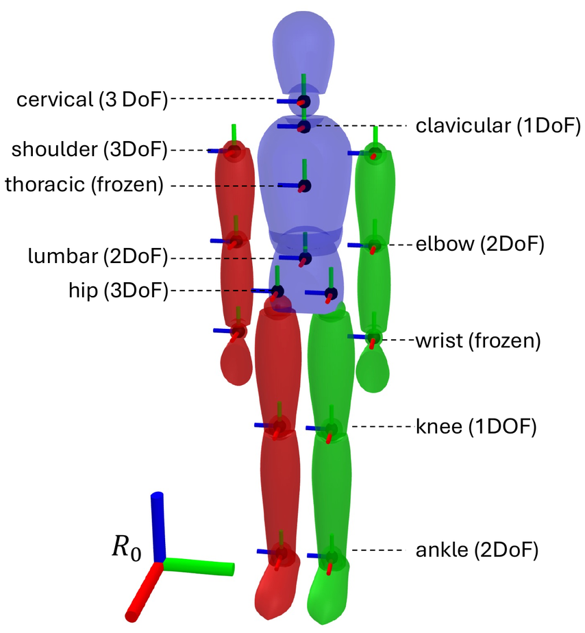

# Outputs and the human model

What a run writes, what each column means, and how to rebuild the person's
model to compute anything else from the results.

## Files

Offline runs write to `output/<participant>/<task>/<variant>/` (see
[offline.md](offline.md)), live runs to `output/<no_trial>/` (see
[live.md](live.md)).

| File | Written by | Contents |
|---|---|---|
| `joint_angles.csv` | all runs | The model's configuration, one row per frame |
| `markers.csv` | all runs | The fused 3D landmarks, one row per frame |
| `run_info.json` | offline runs | The configuration of the run and the person's calibrated model |
| `camera_<id>.mkv` | live runs, with `SAVE_VID` | Each camera's video, a copy of the stream the camera sent |

In live runs, both CSV files start with one frame counter per camera, `Frame_0`,
`Frame_1`, ... in the order of `--cameras`, to check that the cameras stayed in
step. The columns below follow them.

## `joint_angles.csv`

43 columns: the pelvis position and orientation, then 36 joint angles.

| Columns | Unit | Meaning |
|---|---|---|
| `Freeflyer_X[m]`, `Freeflyer_Y[m]`, `Freeflyer_Z[m]` | m | Pelvis position in the world frame |
| `Freeflyer_quaternion_X`, `_Y`, `_Z`, `_W` | | Pelvis orientation, as a quaternion (see [Frames](#frames)) |
| 36 joint angles, such as `Right_Knee_Flexion_Extension[rad]` | rad | One column per degree of freedom, listed below |

The joints and their degrees of freedom:

| Joint | Degrees of freedom (column suffixes) |
|---|---|
| Hip, left and right | `Flexion_Extension`, `Abduction_Adduction`, `Internal_External_Rotation` |
| Knee, left and right | `Flexion_Extension` |
| Ankle, left and right | `Plantarflexion_Dorsiflexion`, `Inversion_Eversion` |
| Lumbar | `Flexion_Extension`, `Lateral_Bending` |
| Thoracic | `Flexion_Extension`, `Lateral_Bending`, `Internal_External_Rotation` |
| Cervical | `Flexion_Extension`, `Lateral_Bending`, `Internal_External_Rotation` |
| Clavicle, left and right | `Elevation_Depression` |
| Shoulder, left and right | `Flexion_Extension`, `Abduction_Adduction`, `Internal_External_Rotation` |
| Elbow, left and right | `Flexion_Extension`, `Pronation_Supination` |
| Wrist, left and right | `Flexion_Extension`, `Radial_Ulnar_Deviation` |

Columns are named `<Side>_<Joint>_<motion>[rad]` (`Lumbar_...`, `Thoracic_...`,
`Cervical_...` have no side), in the model's own order; `joint_angles_names` in
`settings.py` lists them all. They are the column names of the COMFI dataset's
reference, so estimates and motion capture line up without renaming.

## `markers.csv`

A `Frame` column, then `<name>_x`, `<name>_y`, `<name>_z` (m, world frame) for
each of the 43 landmarks of `marker_names` in `settings.py`:

| Region | Landmarks |
|---|---|
| Pelvis | `RASI`, `LASI`, `RPSI`, `LPSI` |
| Trunk | `C7`, `T11`, `T6` |
| Shoulders | `RSHO`, `LSHO` |
| Elbows | `RELB`, `LELB`, `RMELB`, `LMELB` |
| Wrists | `RWRI`, `LWRI`, `RMWRI`, `LMWRI` |
| Hands | `RTHU`, `LTHU`, `RMID`, `LMID`, `RPIN`, `LPIN` |
| Knees | `RKNE`, `LKNE`, `RMKNE`, `LMKNE` |
| Ankles | `RANK`, `LANK`, `RMANK`, `LMANK` |
| Feet | `R5MHD`, `L5MHD`, `RTOE`, `LTOE`, `RHEE`, `LHEE` |
| Head | `Nose`, `Head`, `REar`, `LEar`, `REye`, `LEye` |

The names follow the usual motion capture conventions (`ASI`: anterior superior
iliac spine, `M...`: medial, `5MHD`: fifth metatarsal head, ...). They are
points of NLF's body template, placed where these markers would be.

## Frames

Positions are in the world frame of the calibration: the floor, or the robot
base when the world frame was set with `--robot` (see
[data-format.md](data-format.md)). Without a world pose, they are in the
reference camera's frame.

The pelvis orientation needs one extra step. The model's root joint carries a
fixed rotation, 90° about x, because its segments are built y-up while the world
is z-up. The quaternion in `joint_angles.csv` is the root joint's own rotation;
the pelvis orientation in the world is that fixed rotation followed by the
quaternion. Each offline run records the fixed rotation as
`root_placement_rotation` in `run_info.json`, and `compare_to_mocap.py` takes it
into account.

## The human model

<p align="center">
  
</p>

RT-COSMIK uses the human model of
[example-robot-data](https://github.com/Gepetto/example-robot-data/tree/devel/robots/human_description),
loaded with `example_robot_data.human.HumanLoader`: 16 rigid segments, 36
revolute joints that follow the recommendations of the International Society of
Biomechanics, and a free-flyer joint at the pelvis. Right segments are drawn in
red, left ones in green. In the paper's evaluation the thoracic and wrist joints
were frozen to compare with a baseline that cannot estimate them; RT-COSMIK
estimates them.

The model is fitted to each person in two steps. `HumanLoader` first scales it
from height, mass and sex with anthropometric tables (Dumas et al. 2007, de Leva
1996). On the first frame, RT-COSMIK then sets the segment lengths and the
positions of the landmarks on the segments from the measured landmarks, while
the person stands still.

### Rebuilding the calibrated model

`run_info.json` holds everything needed to rebuild the model a run used, for
example to compute segment positions or distances with
[Pinocchio](https://github.com/stack-of-tasks/pinocchio):

```python
import json

import example_robot_data as erd
import numpy as np
import pandas as pd
import pinocchio as pin

run = "output/2112/RobotWelding/4cam_mhe_acados"
info = json.load(open(f"{run}/run_info.json"))

model = erd.human.HumanLoader(**info["subject"]).robot.model
for joint, translation in zip(model.jointPlacements, info["joint_placements"]):
    joint.translation = np.asarray(translation)
model.jointPlacements[1].rotation = np.asarray(info["root_placement_rotation"])

q = pd.read_csv(f"{run}/joint_angles.csv").to_numpy()
data = model.createData()
pin.framesForwardKinematics(model, data, q[400])
print(data.oMf[model.getFrameId("right_hand")].translation)   # right hand in the world, m
```
